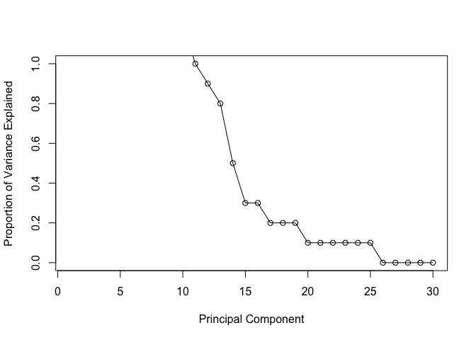
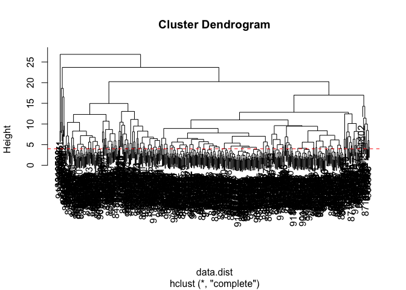
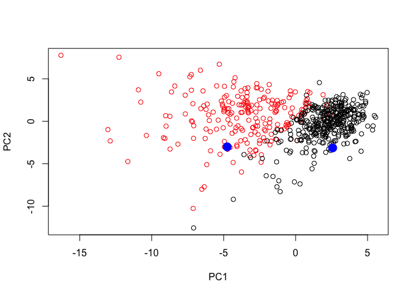

Class 9: Breast cancer analysis with PCA and clustering
================
Karen Li
2/7/2019

Unsupervised Learning Mini-Project

**1. Exploratory Data Analysis**

``` r
fna.data <- "WisconsinCancer.csv"
wisc.df <- read.csv(fna.data)
```

Let's see the first 6 rows of data

``` r
head(wisc.df)
```

    ##         id diagnosis radius_mean texture_mean perimeter_mean area_mean
    ## 1   842302         M       17.99        10.38         122.80    1001.0
    ## 2   842517         M       20.57        17.77         132.90    1326.0
    ## 3 84300903         M       19.69        21.25         130.00    1203.0
    ## 4 84348301         M       11.42        20.38          77.58     386.1
    ## 5 84358402         M       20.29        14.34         135.10    1297.0
    ## 6   843786         M       12.45        15.70          82.57     477.1
    ##   smoothness_mean compactness_mean concavity_mean concave.points_mean
    ## 1         0.11840          0.27760         0.3001             0.14710
    ## 2         0.08474          0.07864         0.0869             0.07017
    ## 3         0.10960          0.15990         0.1974             0.12790
    ## 4         0.14250          0.28390         0.2414             0.10520
    ## 5         0.10030          0.13280         0.1980             0.10430
    ## 6         0.12780          0.17000         0.1578             0.08089
    ##   symmetry_mean fractal_dimension_mean radius_se texture_se perimeter_se
    ## 1        0.2419                0.07871    1.0950     0.9053        8.589
    ## 2        0.1812                0.05667    0.5435     0.7339        3.398
    ## 3        0.2069                0.05999    0.7456     0.7869        4.585
    ## 4        0.2597                0.09744    0.4956     1.1560        3.445
    ## 5        0.1809                0.05883    0.7572     0.7813        5.438
    ## 6        0.2087                0.07613    0.3345     0.8902        2.217
    ##   area_se smoothness_se compactness_se concavity_se concave.points_se
    ## 1  153.40      0.006399        0.04904      0.05373           0.01587
    ## 2   74.08      0.005225        0.01308      0.01860           0.01340
    ## 3   94.03      0.006150        0.04006      0.03832           0.02058
    ## 4   27.23      0.009110        0.07458      0.05661           0.01867
    ## 5   94.44      0.011490        0.02461      0.05688           0.01885
    ## 6   27.19      0.007510        0.03345      0.03672           0.01137
    ##   symmetry_se fractal_dimension_se radius_worst texture_worst
    ## 1     0.03003             0.006193        25.38         17.33
    ## 2     0.01389             0.003532        24.99         23.41
    ## 3     0.02250             0.004571        23.57         25.53
    ## 4     0.05963             0.009208        14.91         26.50
    ## 5     0.01756             0.005115        22.54         16.67
    ## 6     0.02165             0.005082        15.47         23.75
    ##   perimeter_worst area_worst smoothness_worst compactness_worst
    ## 1          184.60     2019.0           0.1622            0.6656
    ## 2          158.80     1956.0           0.1238            0.1866
    ## 3          152.50     1709.0           0.1444            0.4245
    ## 4           98.87      567.7           0.2098            0.8663
    ## 5          152.20     1575.0           0.1374            0.2050
    ## 6          103.40      741.6           0.1791            0.5249
    ##   concavity_worst concave.points_worst symmetry_worst
    ## 1          0.7119               0.2654         0.4601
    ## 2          0.2416               0.1860         0.2750
    ## 3          0.4504               0.2430         0.3613
    ## 4          0.6869               0.2575         0.6638
    ## 5          0.4000               0.1625         0.2364
    ## 6          0.5355               0.1741         0.3985
    ##   fractal_dimension_worst  X
    ## 1                 0.11890 NA
    ## 2                 0.08902 NA
    ## 3                 0.08758 NA
    ## 4                 0.17300 NA
    ## 5                 0.07678 NA
    ## 6                 0.12440 NA

Number of patients is indicated by the number of rows How many samples (ie patients) are in this dataset?

``` r
nrow(wisc.df)
```

    ## [1] 569

``` r
wisc.data <- as.matrix(wisc.df[ ,3:32])
rownames(wisc.data) <- wisc.df$id
```

Finally, setup a separate new vector called diagnosis to be 1 if a diagnosis is malignant ("M") and 0 otherwise. Note that R coerces TRUE to 1 and FALSE to 0.

``` r
wisc.df$diagnosis
```

    ##   [1] M M M M M M M M M M M M M M M M M M M B B B M M M M M M M M M M M M M
    ##  [36] M M B M M M M M M M M B M B B B B B M M B M M B B B B M B M M B B B B
    ##  [71] M B M M B M B M M B B B M M B M M M B B B M B B M M B B B M M B B B B
    ## [106] M B B M B B B B B B B B M M M B M M B B B M M B M B M M B M M B B M B
    ## [141] B M B B B B M B B B B B B B B B M B B B B M M B M B B M M B B M M B B
    ## [176] B B M B B M M M B M B M B B B M B B M M B M M M M B M M M B M B M B B
    ## [211] M B M M M M B B M M B B B M B B B B B M M B B M B B M M B M B B B B M
    ## [246] B B B B B M B M M M M M M M M M M M M M M B B B B B B M B M B B M B B
    ## [281] M B M M B B B B B B B B B B B B B M B B M B M B B B B B B B B B B B B
    ## [316] B B M B B B M B M B B B B M M M B B B B M B M B M B B B M B B B B B B
    ## [351] B M M M B B B B B B B B B B B M M B M M M B M M B B B B B M B B B B B
    ## [386] M B B B M B B M M B B B B B B M B B B B B B B M B B B B B M B B M B B
    ## [421] B B B B B B B B B B M B M M B M B B B B B M B B M B M B B M B M B B B
    ## [456] B B B B B M M B B B B B B M B B B B B B B B B B M B B B B B B B M B M
    ## [491] B B M B B B B B M M B M B M B B B B B M B B M B M B M M B B B M B B B
    ## [526] B B B B B B B B M B M M B B B B B B B B B B B B B B B B B B B B B B B
    ## [561] B B M M M M M M B
    ## Levels: B M

How many cancer(m) and noncancer (b) samples do we have in our dataset?

``` r
table(wisc.df$diagnosis)
```

    ## 
    ##   B   M 
    ## 357 212

``` r
## diagnosis <- as.numeric(wisc.df$diagnosis)

## tmp <- rep(0, nrow(wisc.df))
diagnosis <- as.numeric(wisc.df$diagnosis == "M")
```

Q1. How many observations are in this dataset?

``` r
nrow(wisc.data)
```

    ## [1] 569

Q2. How many variables/features in the data are suffixed with \_mean?

``` r
## colnames(wisc.data)

inds <- grep("_mean", colnames(wisc.data))

length(inds)
```

    ## [1] 10

Q3. How many of the observations have a malignant diagnosis?

``` r
sum(diagnosis)
```

    ## [1] 212

**2. Principal Component Analysis**

``` r
# check column means and standard deviation
colMeans(wisc.data)
```

    ##             radius_mean            texture_mean          perimeter_mean 
    ##            1.412729e+01            1.928965e+01            9.196903e+01 
    ##               area_mean         smoothness_mean        compactness_mean 
    ##            6.548891e+02            9.636028e-02            1.043410e-01 
    ##          concavity_mean     concave.points_mean           symmetry_mean 
    ##            8.879932e-02            4.891915e-02            1.811619e-01 
    ##  fractal_dimension_mean               radius_se              texture_se 
    ##            6.279761e-02            4.051721e-01            1.216853e+00 
    ##            perimeter_se                 area_se           smoothness_se 
    ##            2.866059e+00            4.033708e+01            7.040979e-03 
    ##          compactness_se            concavity_se       concave.points_se 
    ##            2.547814e-02            3.189372e-02            1.179614e-02 
    ##             symmetry_se    fractal_dimension_se            radius_worst 
    ##            2.054230e-02            3.794904e-03            1.626919e+01 
    ##           texture_worst         perimeter_worst              area_worst 
    ##            2.567722e+01            1.072612e+02            8.805831e+02 
    ##        smoothness_worst       compactness_worst         concavity_worst 
    ##            1.323686e-01            2.542650e-01            2.721885e-01 
    ##    concave.points_worst          symmetry_worst fractal_dimension_worst 
    ##            1.146062e-01            2.900756e-01            8.394582e-02

``` r
apply(wisc.data,2,sd)
```

    ##             radius_mean            texture_mean          perimeter_mean 
    ##            3.524049e+00            4.301036e+00            2.429898e+01 
    ##               area_mean         smoothness_mean        compactness_mean 
    ##            3.519141e+02            1.406413e-02            5.281276e-02 
    ##          concavity_mean     concave.points_mean           symmetry_mean 
    ##            7.971981e-02            3.880284e-02            2.741428e-02 
    ##  fractal_dimension_mean               radius_se              texture_se 
    ##            7.060363e-03            2.773127e-01            5.516484e-01 
    ##            perimeter_se                 area_se           smoothness_se 
    ##            2.021855e+00            4.549101e+01            3.002518e-03 
    ##          compactness_se            concavity_se       concave.points_se 
    ##            1.790818e-02            3.018606e-02            6.170285e-03 
    ##             symmetry_se    fractal_dimension_se            radius_worst 
    ##            8.266372e-03            2.646071e-03            4.833242e+00 
    ##           texture_worst         perimeter_worst              area_worst 
    ##            6.146258e+00            3.360254e+01            5.693570e+02 
    ##        smoothness_worst       compactness_worst         concavity_worst 
    ##            2.283243e-02            1.573365e-01            2.086243e-01 
    ##    concave.points_worst          symmetry_worst fractal_dimension_worst 
    ##            6.573234e-02            6.186747e-02            1.806127e-02

``` r
#perform PCA on wisc.data by completing this code
wisc.pr <- prcomp(wisc.data, scale=TRUE)
summary(wisc.pr)
```

    ## Importance of components:
    ##                           PC1    PC2     PC3     PC4     PC5     PC6
    ## Standard deviation     3.6444 2.3857 1.67867 1.40735 1.28403 1.09880
    ## Proportion of Variance 0.4427 0.1897 0.09393 0.06602 0.05496 0.04025
    ## Cumulative Proportion  0.4427 0.6324 0.72636 0.79239 0.84734 0.88759
    ##                            PC7     PC8    PC9    PC10   PC11    PC12
    ## Standard deviation     0.82172 0.69037 0.6457 0.59219 0.5421 0.51104
    ## Proportion of Variance 0.02251 0.01589 0.0139 0.01169 0.0098 0.00871
    ## Cumulative Proportion  0.91010 0.92598 0.9399 0.95157 0.9614 0.97007
    ##                           PC13    PC14    PC15    PC16    PC17    PC18
    ## Standard deviation     0.49128 0.39624 0.30681 0.28260 0.24372 0.22939
    ## Proportion of Variance 0.00805 0.00523 0.00314 0.00266 0.00198 0.00175
    ## Cumulative Proportion  0.97812 0.98335 0.98649 0.98915 0.99113 0.99288
    ##                           PC19    PC20   PC21    PC22    PC23   PC24
    ## Standard deviation     0.22244 0.17652 0.1731 0.16565 0.15602 0.1344
    ## Proportion of Variance 0.00165 0.00104 0.0010 0.00091 0.00081 0.0006
    ## Cumulative Proportion  0.99453 0.99557 0.9966 0.99749 0.99830 0.9989
    ##                           PC25    PC26    PC27    PC28    PC29    PC30
    ## Standard deviation     0.12442 0.09043 0.08307 0.03987 0.02736 0.01153
    ## Proportion of Variance 0.00052 0.00027 0.00023 0.00005 0.00002 0.00000
    ## Cumulative Proportion  0.99942 0.99969 0.99992 0.99997 1.00000 1.00000

Q4. From your results, what proportion of the original variance is captured by the first principal components (PC1)?

Q5. How many principal components (PCs) are required to describe at least 70% of the original variance in the data?

Q6. How many principal components (PCs) are required to describe at least 90% of the original variance in the data?

Let's see a plot of our results

``` r
biplot(wisc.pr)
```


We need to make our own PCA plot

``` r
plot(wisc.pr$x[ ,1], wisc.pr$x[ ,2], col=wisc.df$diagnosis, xlab ="PC1", ylab= "PC2")
```


Q8. Generate a similar plot for principal components 1 and 3. What do you notice about these plots?

``` r
plot(wisc.pr$x[ ,1], wisc.pr$x[ , 3], col=(diagnosis +1), xlab = "PC1", ylab = "PC3")
```


### Variance captured in each PC

``` r
pr.var <- wisc.pr$sdev^2

# variance explained by each principal component
pve <- round((pr.var/sum(pr.var))*100, 1)
```

``` r
# Plot variance explained for each principal component
plot(pve, xlab = "Principal Component", 
     ylab = "Proportion of Variance Explained", 
     ylim = c(0, 1), type = "o")
```



``` r
# Alternative scree plot of the same data, note data driven y-axis
barplot(pve, ylab = "Precent of Variance Explained",
     names.arg=paste0("PC",1:length(pve)), las=2, axes = FALSE)
axis(2, at=pve, labels=round(pve,2) )
```


**3. Hierarchical Clustering**

For hieracrchical clustering we need a few things: 1. Distance matrix **dist()** fucntion 2. the **hclust()** function 3. use the **cutree()** function to fund cluster membership vector

Scale wisc.data

``` r
data.scaled <- scale(wisc.data)

round(apply(data.scaled, 2, sd), 1)
```

    ##             radius_mean            texture_mean          perimeter_mean 
    ##                       1                       1                       1 
    ##               area_mean         smoothness_mean        compactness_mean 
    ##                       1                       1                       1 
    ##          concavity_mean     concave.points_mean           symmetry_mean 
    ##                       1                       1                       1 
    ##  fractal_dimension_mean               radius_se              texture_se 
    ##                       1                       1                       1 
    ##            perimeter_se                 area_se           smoothness_se 
    ##                       1                       1                       1 
    ##          compactness_se            concavity_se       concave.points_se 
    ##                       1                       1                       1 
    ##             symmetry_se    fractal_dimension_se            radius_worst 
    ##                       1                       1                       1 
    ##           texture_worst         perimeter_worst              area_worst 
    ##                       1                       1                       1 
    ##        smoothness_worst       compactness_worst         concavity_worst 
    ##                       1                       1                       1 
    ##    concave.points_worst          symmetry_worst fractal_dimension_worst 
    ##                       1                       1                       1

Calc the Euclidean distance between all pairs of observations in the scaled dataset and assign result to data.dist

``` r
data.dist <- dist(data.scaled)
```

Create a hierarchical clustering model using complete linkage. Manually specify the method argument to hclust() and assign result to wisc.hclust

``` r
wisc.hclust <- hclust(data.dist, method = "complete")
```

Q11. Using the plot() and abline() functions, what is the height at which the clustering model has 4 clusters?

``` r
plot(wisc.hclust)
abline (h=4, col="red", lty=2)
```



**5. Combining methods**

### Cluster in PCA space

For clustering we need: 1. distance matrix 2. clustering function 3. cutree

``` r
plot(wisc.pr$x[,1], wisc.pr$x[,2], col = diagnosis+1)
```


``` r
pc.dist <- dist(wisc.pr$x[,1:2])
pc.hclust <- hclust(pc.dist, method="ward.D2")
plot(pc.hclust)
```


``` r
grps3 <- cutree(pc.hclust, k=3)
table(grps3)
```

    ## grps3
    ##   1   2   3 
    ## 112  83 374

``` r
table(grps3, diagnosis)
```

    ##      diagnosis
    ## grps3   0   1
    ##     1   0 112
    ##     2  18  65
    ##     3 339  35

``` r
plot(wisc.pr$x[,1:3], col=grps3)
```


**7. Prediction**

We will use the predict() function that will take our PCA model from before and new cancer cell data and project that data onto our PCA space.

``` r
url <- "https://tinyurl.com/new-samples-CSV"
new <- read.csv(url)
npc <- predict(wisc.pr, newdata=new)
npc
```

    ##            PC1       PC2        PC3        PC4       PC5        PC6
    ## [1,]  2.576616 -3.135913  1.3990492 -0.7631950  2.781648 -0.8150185
    ## [2,] -4.754928 -3.009033 -0.1660946 -0.6052952 -1.140698 -1.2189945
    ##             PC7        PC8       PC9       PC10      PC11      PC12
    ## [1,] -0.3959098 -0.2307350 0.1029569 -0.9272861 0.3411457  0.375921
    ## [2,]  0.8193031 -0.3307423 0.5281896 -0.4855301 0.7173233 -1.185917
    ##           PC13     PC14      PC15       PC16        PC17        PC18
    ## [1,] 0.1610764 1.187882 0.3216974 -0.1743616 -0.07875393 -0.11207028
    ## [2,] 0.5893856 0.303029 0.1299153  0.1448061 -0.40509706  0.06565549
    ##             PC19       PC20       PC21       PC22       PC23       PC24
    ## [1,] -0.08802955 -0.2495216  0.1228233 0.09358453 0.08347651  0.1223396
    ## [2,]  0.25591230 -0.4289500 -0.1224776 0.01732146 0.06316631 -0.2338618
    ##             PC25         PC26         PC27        PC28         PC29
    ## [1,]  0.02124121  0.078884581  0.220199544 -0.02946023 -0.015620933
    ## [2,] -0.20755948 -0.009833238 -0.001134152  0.09638361  0.002795349
    ##              PC30
    ## [1,]  0.005269029
    ## [2,] -0.019015820

``` r
plot(wisc.pr$x[,1:2], col=diagnosis+1)
points(npc[,1], npc[,2], col="blue", pch=16, cex=2)
```



Q17. Which of these new patients should we prioritize for follow up based on your results? The two blue points above represent our two new patients. The one with a larger PC1 value should be prioritized.

**Important functions used in this class** grep ("\_mean", x) prcomp (x, scale = TRUE) hclust (dist(x), method = "")
