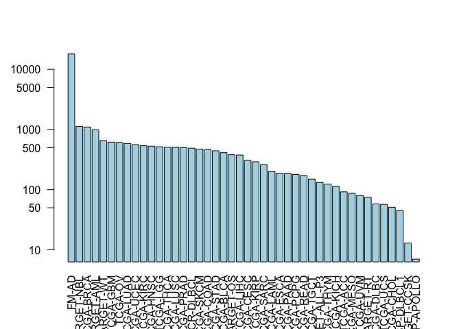
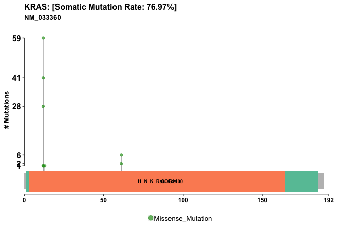

Class 18: Cancer Genomics
================

NCI Genomic Data Commons
------------------------

``` r
library(GenomicDataCommons)
```

    ## Loading required package: magrittr

    ## 
    ## Attaching package: 'GenomicDataCommons'

    ## The following object is masked from 'package:stats':
    ## 
    ##     filter

``` r
library(TCGAbiolinks)
library(maftools)
```

``` r
status()
```

    ## $commit
    ## [1] "e4b233ceb9a8183f93005e77f0754eae0418c073"
    ## 
    ## $data_release
    ## [1] "Data Release 15.0 - February 20, 2019"
    ## 
    ## $status
    ## [1] "OK"
    ## 
    ## $tag
    ## [1] "1.19.0"
    ## 
    ## $version
    ## [1] 1

``` r
cases_by_project <- cases() %>%
  facet("project.project_id") %>%
  aggregations()

head(cases_by_project)
```

    ## $project.project_id
    ##               key doc_count
    ## 1           FM-AD     18004
    ## 2      TARGET-NBL      1127
    ## 3       TCGA-BRCA      1098
    ## 4      TARGET-AML       988
    ## 5       TARGET-WT       652
    ## 6        TCGA-GBM       617
    ## 7         TCGA-OV       608
    ## 8       TCGA-LUAD       585
    ## 9       TCGA-UCEC       560
    ## 10      TCGA-KIRC       537
    ## 11      TCGA-HNSC       528
    ## 12       TCGA-LGG       516
    ## 13      TCGA-THCA       507
    ## 14      TCGA-LUSC       504
    ## 15      TCGA-PRAD       500
    ## 16   NCICCR-DLBCL       489
    ## 17      TCGA-SKCM       470
    ## 18      TCGA-COAD       461
    ## 19      TCGA-STAD       443
    ## 20      TCGA-BLCA       412
    ## 21      TARGET-OS       381
    ## 22      TCGA-LIHC       377
    ## 23      TCGA-CESC       307
    ## 24      TCGA-KIRP       291
    ## 25      TCGA-SARC       261
    ## 26      TCGA-LAML       200
    ## 27      TCGA-ESCA       185
    ## 28      TCGA-PAAD       185
    ## 29      TCGA-PCPG       179
    ## 30      TCGA-READ       172
    ## 31      TCGA-TGCT       150
    ## 32  TARGET-ALL-P3       131
    ## 33      TCGA-THYM       124
    ## 34      TCGA-KICH       113
    ## 35       TCGA-ACC        92
    ## 36      TCGA-MESO        87
    ## 37       TCGA-UVM        80
    ## 38      TARGET-RT        75
    ## 39      TCGA-DLBC        58
    ## 40       TCGA-UCS        57
    ## 41      TCGA-CHOL        51
    ## 42    CTSP-DLBCL1        45
    ## 43    TARGET-CCSK        13
    ## 44 VAREPOP-APOLLO         7

``` r
x <- cases_by_project$project.project_id

# Make a custom color vector for our plot
colvec <- rep("lightblue", nrow(x))
#colvec[] <- "red"

# Plot with 'log' for y axis and rotate labels with 'las'
#par(___)  
barplot(x$doc_count, names.arg = x$key, log="y", col=colvec, las=2)
```



``` r
maf.file <- GDCquery_Maf(tumor="PAAD", pipelines = "mutect")
```

    ## ============================================================================

    ##  For more information about MAF data please read the following GDC manual and web pages:

    ##  GDC manual: https://gdc-docs.nci.nih.gov/Data/PDF/Data_UG.pdf

    ##  https://gdc-docs.nci.nih.gov/Data/Bioinformatics_Pipelines/DNA_Seq_Variant_Calling_Pipeline/

    ##  https://gdc.cancer.gov/about-gdc/variant-calling-gdc

    ## ============================================================================

    ## --------------------------------------

    ## o GDCquery: Searching in GDC database

    ## --------------------------------------

    ## Genome of reference: hg38

    ## --------------------------------------------

    ## oo Accessing GDC. This might take a while...

    ## --------------------------------------------

    ## ooo Project: TCGA-PAAD

    ## --------------------

    ## oo Filtering results

    ## --------------------

    ## ooo By access

    ## ooo By data.type

    ## ooo By workflow.type

    ## ----------------

    ## oo Checking data

    ## ----------------

    ## ooo Check if there are duplicated cases

    ## ooo Check if there results for the query

    ## -------------------

    ## o Preparing output

    ## -------------------

    ## Downloading data for project TCGA-PAAD

    ## Of the 1 files for download 1 already exist.

    ## All samples have been already downloaded

    ## 
    |==                                                         |   3%    1 MB
    |==                                                         |   3%    1 MB
    |==                                                         |   4%    1 MB
    |==                                                         |   4%    1 MB
    |==                                                         |   4%    2 MB
    |===                                                        |   5%    2 MB
    |===                                                        |   5%    2 MB
    |===                                                        |   5%    2 MB
    |===                                                        |   5%    2 MB
    |===                                                        |   6%    2 MB
    |===                                                        |   6%    2 MB
    |====                                                       |   6%    2 MB
    |====                                                       |   7%    2 MB
    |====                                                       |   7%    3 MB
    |====                                                       |   7%    3 MB
    |====                                                       |   7%    3 MB
    |====                                                       |   8%    3 MB
    |=====                                                      |   8%    3 MB
    |=====                                                      |   8%    3 MB
    |=====                                                      |   9%    3 MB
    |=====                                                      |   9%    3 MB
    |=====                                                      |   9%    4 MB
    |=====                                                      |   9%    4 MB
    |======                                                     |  10%    4 MB
    |======                                                     |  10%    4 MB
    |======                                                     |  10%    4 MB
    |======                                                     |  10%    4 MB
    |======                                                     |  11%    4 MB
    |======                                                     |  11%    4 MB
    |=======                                                    |  11%    4 MB
    |=======                                                    |  12%    5 MB
    |=======                                                    |  12%    5 MB
    |=======                                                    |  12%    5 MB
    |=======                                                    |  12%    5 MB
    |=======                                                    |  13%    5 MB
    |========                                                   |  13%    5 MB
    |========                                                   |  13%    5 MB
    |========                                                   |  14%    5 MB
    |========                                                   |  14%    6 MB
    |========                                                   |  14%    6 MB
    |========                                                   |  14%    6 MB
    |=========                                                  |  15%    6 MB
    |=========                                                  |  15%    6 MB
    |=========                                                  |  15%    6 MB
    |=========                                                  |  16%    6 MB
    |=========                                                  |  16%    6 MB
    |=========                                                  |  16%    6 MB
    |==========                                                 |  16%    7 MB
    |==========                                                 |  17%    7 MB
    |==========                                                 |  17%    7 MB
    |==========                                                 |  17%    7 MB
    |==========                                                 |  17%    7 MB
    |==========                                                 |  18%    7 MB
    |===========                                                |  18%    7 MB
    |===========                                                |  18%    7 MB
    |===========                                                |  19%    8 MB
    |===========                                                |  19%    8 MB
    |===========                                                |  19%    8 MB
    |===========                                                |  19%    8 MB
    |============                                               |  20%    8 MB
    |============                                               |  20%    8 MB
    |============                                               |  20%    8 MB
    |============                                               |  20%    8 MB
    |============                                               |  21%    8 MB
    |============                                               |  21%    9 MB
    |=============                                              |  21%    9 MB
    |=============                                              |  21%    9 MB
    |=============                                              |  22%    9 MB
    |=============                                              |  22%    9 MB
    |=============                                              |  22%    9 MB
    |=============                                              |  23%    9 MB
    |=============                                              |  23%    9 MB
    |==============                                             |  23%    9 MB
    |==============                                             |  23%   10 MB
    |==============                                             |  24%   10 MB
    |==============                                             |  24%   10 MB
    |==============                                             |  24%   10 MB
    |==============                                             |  24%   10 MB
    |===============                                            |  25%   10 MB
    |===============                                            |  25%   10 MB
    |===============                                            |  25%   10 MB
    |===============                                            |  25%   10 MB
    |===============                                            |  26%   11 MB
    |===============                                            |  26%   11 MB
    |===============                                            |  26%   11 MB
    |================                                           |  26%   11 MB
    |================                                           |  27%   11 MB
    |================                                           |  27%   11 MB
    |================                                           |  27%   11 MB
    |================                                           |  28%   11 MB
    |=================                                          |  28%   11 MB
    |=================                                          |  28%   12 MB
    |=================                                          |  28%   12 MB
    |=================                                          |  29%   12 MB
    |=================                                          |  29%   12 MB
    |=================                                          |  29%   12 MB
    |==================                                         |  30%   12 MB
    |==================                                         |  30%   12 MB
    |==================                                         |  30%   12 MB
    |==================                                         |  30%   13 MB
    |==================                                         |  31%   13 MB
    |==================                                         |  31%   13 MB
    |===================                                        |  31%   13 MB
    |===================                                        |  32%   13 MB
    |===================                                        |  32%   13 MB
    |===================                                        |  32%   13 MB
    |===================                                        |  33%   13 MB
    |===================                                        |  33%   14 MB
    |====================                                       |  33%   14 MB
    |====================                                       |  33%   14 MB
    |====================                                       |  34%   14 MB
    |====================                                       |  34%   14 MB
    |====================                                       |  34%   14 MB
    |====================                                       |  34%   14 MB
    |=====================                                      |  35%   14 MB
    |=====================                                      |  35%   14 MB
    |=====================                                      |  35%   15 MB
    |=====================                                      |  36%   15 MB
    |=====================                                      |  36%   15 MB
    |=====================                                      |  36%   15 MB
    |======================                                     |  36%   15 MB
    |======================                                     |  37%   15 MB
    |======================                                     |  37%   15 MB
    |======================                                     |  37%   15 MB
    |======================                                     |  37%   15 MB
    |======================                                     |  38%   16 MB
    |=======================                                    |  38%   16 MB
    |=======================                                    |  38%   16 MB
    |=======================                                    |  38%   16 MB
    |=======================                                    |  39%   16 MB
    |=======================                                    |  39%   16 MB
    |=======================                                    |  39%   16 MB
    |=======================                                    |  39%   16 MB
    |========================                                   |  40%   16 MB
    |========================                                   |  40%   17 MB
    |========================                                   |  40%   17 MB
    |========================                                   |  41%   17 MB
    |========================                                   |  41%   17 MB
    |=========================                                  |  41%   17 MB
    |=========================                                  |  41%   17 MB
    |=========================                                  |  42%   17 MB
    |=========================                                  |  42%   17 MB
    |=========================                                  |  42%   18 MB
    |=========================                                  |  43%   18 MB
    |==========================                                 |  43%   18 MB
    |==========================                                 |  43%   18 MB
    |==========================                                 |  43%   18 MB
    |==========================                                 |  44%   18 MB
    |==========================                                 |  44%   18 MB
    |==========================                                 |  44%   18 MB
    |==========================                                 |  44%   18 MB
    |===========================                                |  45%   19 MB
    |===========================                                |  45%   19 MB
    |===========================                                |  45%   19 MB
    |===========================                                |  46%   19 MB
    |===========================                                |  46%   19 MB
    |===========================                                |  46%   19 MB
    |============================                               |  46%   19 MB
    |============================                               |  47%   19 MB
    |============================                               |  47%   19 MB
    |============================                               |  47%   20 MB
    |============================                               |  47%   20 MB
    |============================                               |  48%   20 MB
    |=============================                              |  48%   20 MB
    |=============================                              |  48%   20 MB
    |=============================                              |  49%   20 MB
    |=============================                              |  49%   20 MB
    |=============================                              |  49%   20 MB
    |=============================                              |  49%   20 MB
    |==============================                             |  50%   21 MB
    |==============================                             |  50%   21 MB
    |==============================                             |  50%   21 MB
    |==============================                             |  50%   21 MB
    |==============================                             |  51%   21 MB
    |==============================                             |  51%   21 MB
    |===============================                            |  51%   21 MB
    |===============================                            |  51%   21 MB
    |===============================                            |  52%   21 MB
    |===============================                            |  52%   22 MB
    |===============================                            |  52%   22 MB
    |===============================                            |  53%   22 MB
    |===============================                            |  53%   22 MB
    |================================                           |  53%   22 MB
    |================================                           |  53%   22 MB
    |================================                           |  54%   22 MB
    |================================                           |  54%   22 MB
    |================================                           |  54%   22 MB
    |================================                           |  54%   23 MB
    |=================================                          |  55%   23 MB
    |=================================                          |  55%   23 MB
    |=================================                          |  55%   23 MB
    |=================================                          |  55%   23 MB
    |=================================                          |  56%   23 MB
    |=================================                          |  56%   23 MB
    |==================================                         |  56%   23 MB
    |==================================                         |  56%   23 MB
    |==================================                         |  57%   24 MB
    |==================================                         |  57%   24 MB
    |==================================                         |  57%   24 MB
    |==================================                         |  58%   24 MB
    |===================================                        |  58%   24 MB
    |===================================                        |  58%   24 MB
    |===================================                        |  59%   24 MB
    |===================================                        |  59%   24 MB
    |===================================                        |  59%   25 MB
    |===================================                        |  59%   25 MB
    |====================================                       |  60%   25 MB
    |====================================                       |  60%   25 MB
    |====================================                       |  60%   25 MB
    |====================================                       |  61%   25 MB
    |====================================                       |  61%   25 MB
    |====================================                       |  61%   25 MB
    |=====================================                      |  61%   26 MB
    |=====================================                      |  62%   26 MB
    |=====================================                      |  62%   26 MB
    |=====================================                      |  62%   26 MB
    |=====================================                      |  63%   26 MB
    |======================================                     |  63%   26 MB
    |======================================                     |  63%   26 MB
    |======================================                     |  63%   26 MB
    |======================================                     |  64%   26 MB
    |======================================                     |  64%   27 MB
    |======================================                     |  64%   27 MB
    |======================================                     |  64%   27 MB
    |=======================================                    |  65%   27 MB
    |=======================================                    |  65%   27 MB
    |=======================================                    |  65%   27 MB
    |=======================================                    |  66%   27 MB
    |=======================================                    |  66%   27 MB
    |=======================================                    |  66%   27 MB
    |========================================                   |  66%   28 MB
    |========================================                   |  67%   28 MB
    |========================================                   |  67%   28 MB
    |========================================                   |  67%   28 MB
    |========================================                   |  67%   28 MB
    |========================================                   |  68%   28 MB
    |=========================================                  |  68%   28 MB
    |=========================================                  |  68%   28 MB
    |=========================================                  |  69%   29 MB
    |=========================================                  |  69%   29 MB
    |=========================================                  |  69%   29 MB
    |==========================================                 |  70%   29 MB
    |==========================================                 |  70%   29 MB
    |==========================================                 |  70%   29 MB
    |==========================================                 |  70%   29 MB
    |==========================================                 |  71%   29 MB
    |==========================================                 |  71%   30 MB
    |===========================================                |  71%   30 MB
    |===========================================                |  72%   30 MB
    |===========================================                |  72%   30 MB
    |===========================================                |  72%   30 MB
    |===========================================                |  73%   30 MB
    |============================================               |  73%   30 MB
    |============================================               |  73%   31 MB
    |============================================               |  74%   31 MB
    |============================================               |  74%   31 MB
    |============================================               |  74%   31 MB
    |============================================               |  74%   31 MB
    |=============================================              |  75%   31 MB
    |=============================================              |  75%   31 MB
    |=============================================              |  75%   31 MB
    |=============================================              |  76%   32 MB
    |=============================================              |  76%   32 MB
    |==============================================             |  76%   32 MB
    |==============================================             |  77%   32 MB
    |==============================================             |  77%   32 MB
    |==============================================             |  77%   32 MB
    |==============================================             |  77%   32 MB
    |==============================================             |  78%   32 MB
    |===============================================            |  78%   33 MB
    |===============================================            |  78%   33 MB
    |===============================================            |  79%   33 MB
    |===============================================            |  79%   33 MB
    |===============================================            |  79%   33 MB
    |================================================           |  80%   33 MB
    |================================================           |  80%   33 MB
    |================================================           |  80%   33 MB
    |================================================           |  80%   33 MB
    |================================================           |  81%   34 MB
    |================================================           |  81%   34 MB
    |=================================================          |  81%   34 MB
    |=================================================          |  82%   34 MB
    |=================================================          |  82%   34 MB
    |=================================================          |  82%   34 MB
    |=================================================          |  82%   34 MB
    |=================================================          |  83%   34 MB
    |==================================================         |  83%   35 MB
    |==================================================         |  83%   35 MB
    |==================================================         |  84%   35 MB
    |==================================================         |  84%   35 MB
    |==================================================         |  84%   35 MB
    |==================================================         |  84%   35 MB
    |===================================================        |  85%   35 MB
    |===================================================        |  85%   35 MB
    |===================================================        |  85%   36 MB
    |===================================================        |  85%   36 MB
    |===================================================        |  86%   36 MB
    |===================================================        |  86%   36 MB
    |====================================================       |  86%   36 MB
    |====================================================       |  87%   36 MB
    |====================================================       |  87%   36 MB
    |====================================================       |  87%   36 MB
    |====================================================       |  87%   36 MB
    |====================================================       |  88%   37 MB
    |====================================================       |  88%   37 MB
    |=====================================================      |  88%   37 MB
    |=====================================================      |  88%   37 MB
    |=====================================================      |  89%   37 MB
    |=====================================================      |  89%   37 MB
    |=====================================================      |  89%   37 MB
    |=====================================================      |  89%   37 MB
    |======================================================     |  90%   37 MB
    |======================================================     |  90%   38 MB
    |======================================================     |  90%   38 MB
    |======================================================     |  91%   38 MB
    |======================================================     |  91%   38 MB
    |======================================================     |  91%   38 MB
    |=======================================================    |  91%   38 MB
    |=======================================================    |  92%   38 MB
    |=======================================================    |  92%   38 MB
    |=======================================================    |  92%   38 MB
    |=======================================================    |  92%   39 MB
    |=======================================================    |  93%   39 MB
    |========================================================   |  93%   39 MB
    |========================================================   |  93%   39 MB
    |========================================================   |  94%   39 MB
    |========================================================   |  94%   39 MB
    |========================================================   |  94%   39 MB
    |========================================================   |  94%   39 MB
    |=========================================================  |  95%   40 MB
    |=========================================================  |  95%   40 MB
    |=========================================================  |  95%   40 MB
    |=========================================================  |  96%   40 MB
    |=========================================================  |  96%   40 MB
    |=========================================================  |  96%   40 MB
    |========================================================== |  96%   40 MB
    |========================================================== |  97%   40 MB
    |========================================================== |  97%   40 MB
    |========================================================== |  97%   41 MB
    |========================================================== |  97%   41 MB
    |========================================================== |  98%   41 MB
    |===========================================================|  98%   41 MB
    |===========================================================|  98%   41 MB
    |===========================================================|  99%   41 MB
    |===========================================================|  99%   41 MB
    |===========================================================|  99%   41 MB
    |===========================================================|  99%   41 MB
    |============================================================| 100%   42 MB

``` r
vars = read.maf(maf = maf.file, verbose = FALSE)
```

``` r
plotmafSummary(vars)
```


``` r
lollipopPlot(vars, gene='KRAS')
```

    ## Assuming protein change information are stored under column HGVSp_Short. Use argument AACol to override if necessary.

    ## 2 transcripts available. Use arguments refSeqID or proteinID to manually specify tx name.

    ##    HGNC refseq.ID protein.ID aa.length
    ## 1: KRAS NM_004985  NP_004976       188
    ## 2: KRAS NM_033360  NP_203524       189

    ## Using longer transcript NM_033360 for now.


